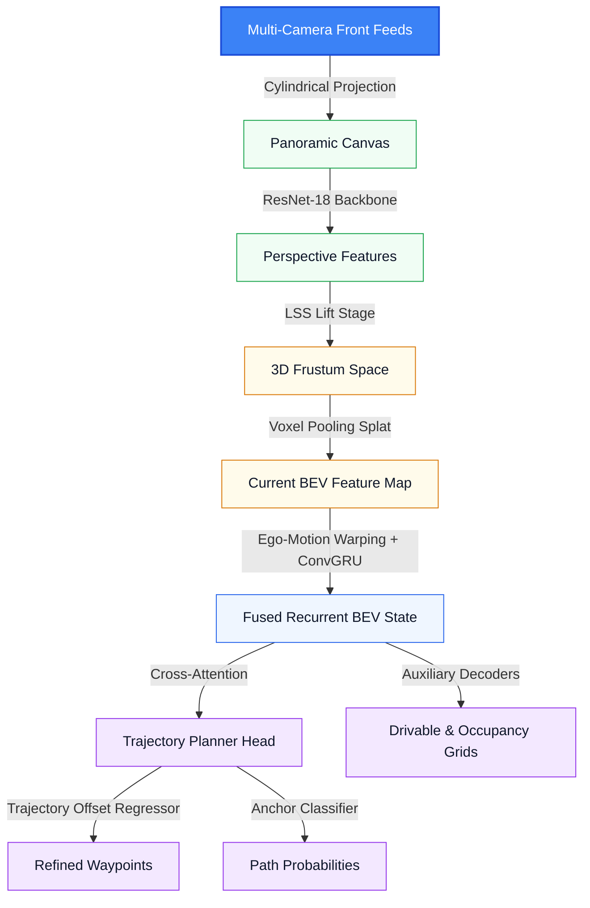

# VectorDrive-Route

> [!WARNING]
> This repository is a research prototype. Code, notebooks, and checkpoints change frequently.

VectorDrive-Route maps multi-camera inputs to a Bird's-Eye-View (BEV) representation and predicts future ego trajectories. The code trains and evaluates models on the nuScenes dataset.

## Quick Start

- Clone and install dependencies:

```bash
python3.11 -m venv .venv
source .venv/bin/activate
pip install -r requirements.txt
```

- Download `nuScenes-mini` and place it under `data/nuscenes/`.

Run training, evaluation, or visualization scripts from the project root. Examples:

Train:

```bash
PYTHONPATH=. .venv/bin/python scripts/train.py --epochs 50 --batch_size 4 --lr 2e-4 --save_dir checkpoints
```

Evaluate:

```bash
PYTHONPATH=. .venv/bin/python scripts/evaluate.py --checkpoint checkpoints/best_model.pth
```

## Project Structure

- `baselines/` — simple baselines (constant velocity, ego-mlp)
- `checkpoints/` — model checkpoints and diagnostics
- `data/nuscenes/` — dataset (put nuScenes-mini here)
- `datasets/` — dataset loader and grid targets
- `geometry/` — projection and voxel pooling code
- `losses/` — multi-task losses
- `metrics/` — evaluation metrics
- `models/` — model components and planning head
- `scripts/` — train/evaluate runners
- `utils/` — utilities (e.g., k-means anchors)

## Architecture



**Key components:**

- Cylindrical projection: stitches front cameras into a panorama and reprojects pixels for sampling.
- Backbone + LSS: extracts perspective features and lifts them into depth-conditioned frustums.
- Voxel pooling: aggregates frustum features into a top-down BEV grid (100×100, X∈[-20,20]m, Y∈[0,40]m).
- Temporal fusion: warps past BEV states to the current frame and fuses them with a ConvGRU.
- Planning head: queries compressed BEV tokens with K-Means anchors (K=16) to classify and regress candidate trajectories.
- Auxiliary decoders: predict drivable area and occupancy grids used for safety checks.

## Stages

This section explains the eight visualization stages.

1. Stage 1 — Cylindrical Stitching
   - Merge three front cameras into a single cylindrical panorama.
   - Remove overlap and create a continuous sampling canvas for projection.

   

2. Stage 2 — Backbone Features
   - Run a ResNet-18 backbone on the panorama to get dense features.

   

3. Stage 3 — LSS Depth Lift
   - Predict categorical depth probabilities and lift 2D features into a 3D frustum.
   - Provide depth-conditioned features for BEV pooling.

   

4. Stage 4 — Voxel Pooling & Smoothing
   - Project frustum features into a BEV grid and apply lateral smoothing (BEVResBlocks).
   - Gather scene context and reduce radial projection streaks.

   

5. Stage 5 — Warping & Temporal Fusion
   - Warp the previous BEV to the current frame using ego motion, then fuse via ConvGRU.
   - Build a temporally consistent BEV state.

   

6. Stage 6 — Trajectory Classification
   - Compress BEV into scene tokens and score K=16 anchors with cross-attention.
   - Rank candidate paths.

7. Stage 7 — Trajectory Regression
   - Regress offsets for selected anchors to produce trajectories the vehicle can follow.

   

8. Stage 8 — Auxiliary Decoders & Safety Metrics
   - Predict drivable and occupancy grids.
     

Open the notebook to see the figures and the code that produces them: [visualizations.ipynb](visualizations.ipynb).
