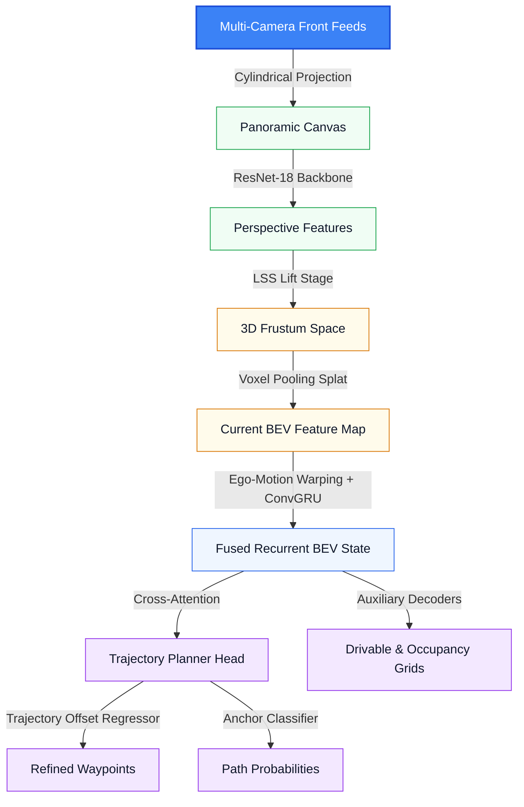
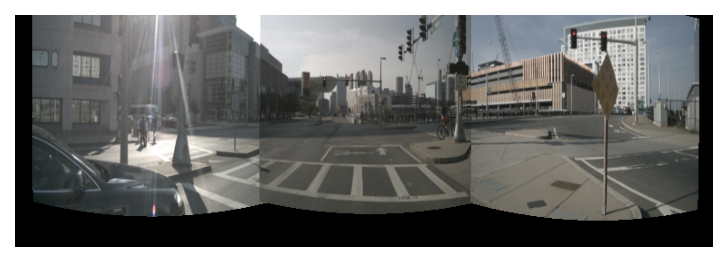
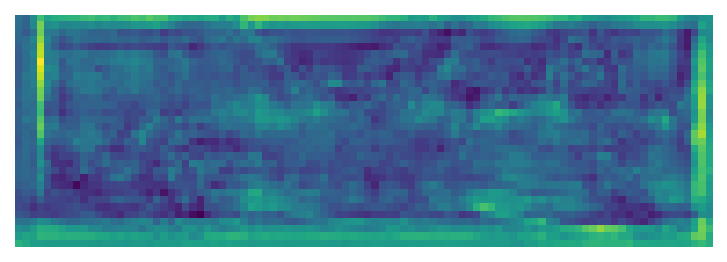
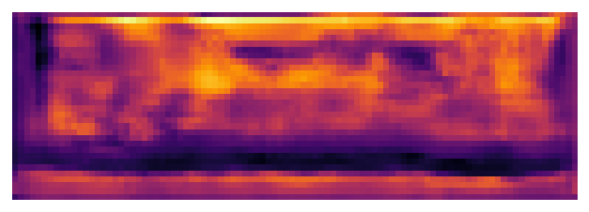
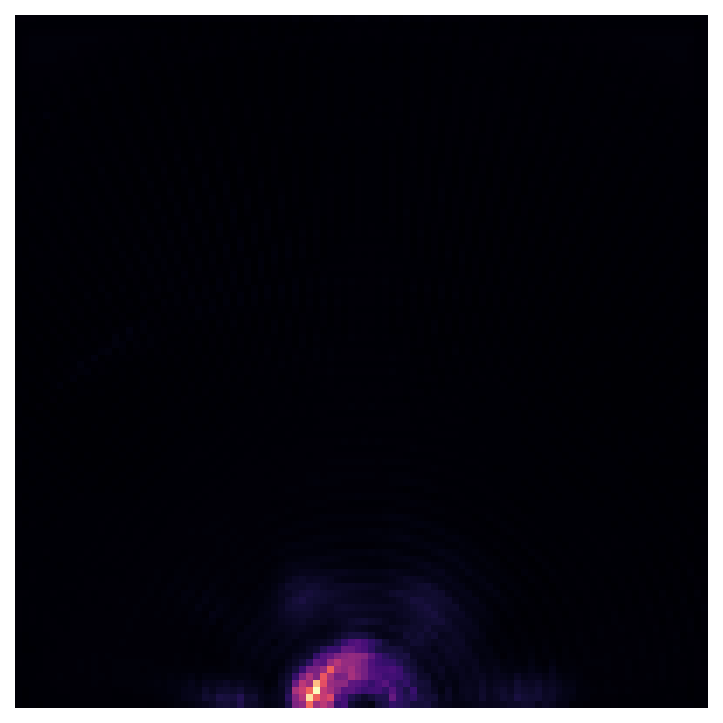
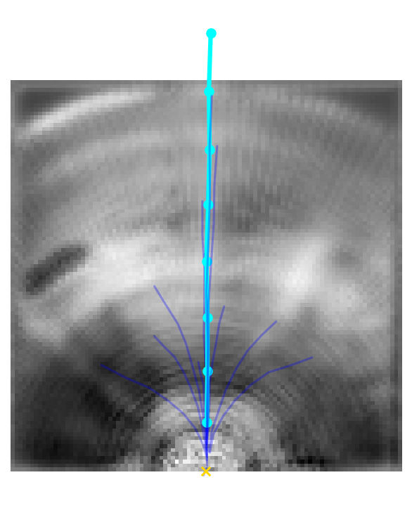
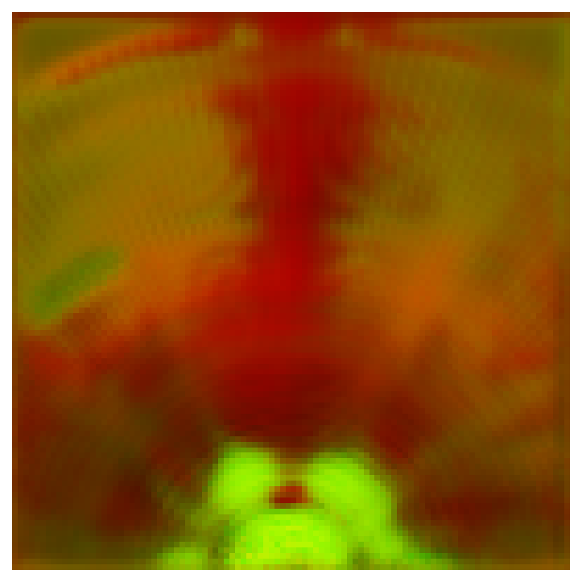

# VectorDrive-Route

Disclaimer: this repository is a research prototype. Code, notebooks, and checkpoints change frequently.

VectorDrive-Route maps multi-camera inputs to a Bird's-Eye-View (BEV) representation and predicts future ego trajectories. The code trains and evaluates models on the nuScenes dataset.

## Quick Start

- Clone and install dependencies:

```bash
git clone https://github.com/LaloVene/vectordrive-route.git
cd vectordrive-route
python3.11 -m venv .venv
source .venv/bin/activate
pip install -r requirements.txt
```

- Download `nuScenes-mini` and place it under `data/nuscenes/`.

Run training, evaluation, or visualization scripts from the project root. Examples:

Train (short run):

```bash
PYTHONPATH=. .venv/bin/python scripts/train.py --epochs 5 --batch_size 4 --lr 2e-4 --save_dir checkpoints
```

Evaluate:

```bash
PYTHONPATH=. .venv/bin/python scripts/evaluate.py --checkpoint checkpoints/best_model.pth
```

Visualize diagnostics:

```bash
PYTHONPATH=. .venv/bin/python scripts/visualize.py --checkpoint checkpoints/best_model.pth --save_path checkpoints/diagnostics.png
```

## Project Layout

- `baselines/` — simple baselines (constant velocity, ego-mlp)
- `checkpoints/` — model checkpoints and diagnostics
- `data/nuscenes/` — dataset (put nuScenes-mini here)
- `datasets/` — dataset loader and grid targets
- `geometry/` — projection and voxel pooling code
- `losses/` — multi-task losses
- `metrics/` — evaluation metrics
- `models/` — model components and planning head
- `scripts/` — train/evaluate/visualize runners
- `utils/` — utilities (e.g., k-means anchors)

## Architecture Overview



Key components (short):

- Cylindrical projection: stitches front cameras into a panorama and reprojects pixels for sampling.
- Backbone + LSS: extracts perspective features and lifts them into depth-conditioned frustums.
- Voxel pooling: aggregates frustum features into a top-down BEV grid (100×100, X∈[-20,20]m, Y∈[0,40]m).
- Temporal fusion: warps past BEV states to the current frame and fuses them with a ConvGRU.
- Planning head: queries compressed BEV tokens with K-Means anchors (K=16) to classify and regress candidate trajectories.
- Auxiliary decoders: predict drivable area and occupancy grids used for safety checks.

## Stages and Visualizations

This section explains the eight visualization stages and links the notebook examples.

1. Stage 1 — Cylindrical Stitching
   - What: Merge three front cameras into a single cylindrical panorama.
   - Why: Remove overlap and create a continuous sampling canvas for projection.
   - Visuals: stitched panorama, validity and seam masks.

2. Stage 2 — Backbone Features
   - What: Run a ResNet-18 backbone on the panorama to get dense features.
   - Why: Prepare features for depth estimation and lifting.
   - Visuals: mean-channel activation maps.

3. Stage 3 — LSS Depth Lift
   - What: Predict categorical depth probabilities and lift 2D features into a 3D frustum.
   - Why: Provide depth-conditioned features for BEV pooling.
   - Visuals: expected depth map vs sparse LiDAR points.

4. Stage 4 — Voxel Pooling & Smoothing
   - What: Project frustum features into a BEV grid and apply lateral smoothing (BEVResBlocks).
   - Why: Gather scene context and reduce radial projection streaks.
   - Visuals: raw vs smoothed BEV feature maps.

5. Stage 5 — Warping & Temporal Fusion
   - What: Warp the previous BEV to the current frame using ego motion, then fuse via ConvGRU.
   - Why: Build a temporally consistent BEV state.
   - Visuals: previous, warped, and fused BEV maps.

6. Stage 6 — Trajectory Classification
   - What: Compress BEV into scene tokens and score K=16 anchors with cross-attention.
   - Why: Rank candidate paths.
   - Visuals: anchor selection probabilities.

7. Stage 7 — Trajectory Regression
   - What: Regress offsets for selected anchors to get refined waypoints.
   - Why: Produce metric trajectories the vehicle can follow.
   - Visuals: all candidate trajectories and chosen path overlayed on drivable map.

8. Stage 8 — Auxiliary Decoders & Safety Metrics
   - What: Predict drivable and occupancy grids; compute collision/drivable-compliance for trajectories.
   - Why: Provide safety checks and diagnostics.
   - Visuals: side-by-side ground-truth vs predicted maps and annotated metrics.

Open the notebook to see the figures and the code that produces them: [visualizations.ipynb](visualizations.ipynb).

## Diagnostics

The visualization script saves diagnostic panels illustrating panorama inputs, depth lifts, BEV maps, and planned trajectories. A sample output is saved to `checkpoints/diagnostics.png`.


### Stage images

Below are per-stage images produced by `scripts/visualize_stages.py`. These illustrate the pipeline steps from input stitching to final decoders.

- Stage 1 — Cylindrical panorama

  

- Stage 2 — Backbone mean activations

  

- Stage 3 — Predicted expected depth

  

- Stage 4 — Raw BEV (pre-smoothing)

  

- Stage 5 — BEV after smoothing

  

- Stage 6 — Warped previous BEV (visualization)

  

- Stage 7 — Candidate trajectories (chosen in cyan)

  

- Stage 8 — Decoders (drivable=green, occupancy=red)

  

## Checkpoints & Loading Notes

- Some checkpoints contain pickled objects beyond a raw `state_dict`. To load a checkpoint that contains extra fields, use:

```python
checkpoint = torch.load(path, map_location=device, weights_only=False)
model = VectorDriveRouteModel(anchors=checkpoint.get('anchors'))
model.load_state_dict(checkpoint['model_state_dict'], strict=False)
```

## Evaluation Notes

- The repo includes open-loop evaluation scripts (ADE, collision checks, drivable compliance). Open-loop metrics can penalize reasonable plans when the human driver chooses a different maneuver; consider closed-loop simulation for end-to-end behavior evaluation.

## Contact

For questions or collaboration, open an issue or contact the author.
