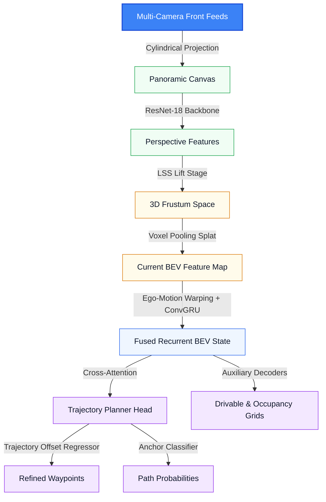

# VectorDrive-Route

`VectorDrive-Route` is an end-to-end multi-view camera-to-3D Bird's-Eye-View (BEV) trajectory planner for autonomous driving, trained and evaluated on the `nuScenes` dataset.

The pipeline processes multi-camera streams, constructs a spatial-temporal BEV scene representation, and uses a query-based cross-attention head to select and refine safe driving trajectories.

---

## 🚀 Key Architecture Highlights



* **Unified Cylindrical Camera Stitching**: Eliminates redundant overlapping pixels and maps multi-camera feeds (`CAM_FRONT_LEFT`, `CAM_FRONT`, `CAM_FRONT_RIGHT`) into a stitched 120° panorama canvas.
* **Backbone & Categorical Depth Lift (LSS)**: Uses a `ResNet-18` backbone to extract perspective features, and categorizes them into discrete depth bins (2.0m to 42.0m range) using sparse depth maps constructed from raw 32-beam `LIDAR_TOP` scans.
* **Vectorized Voxel Pooling (Splat)**: Aggregates frustum context into a top-down $100 \times 100$ BEV grid representing $X \in [-20, 20]\text{m}$ and $Y \in [0, 40]\text{m}$ at 0.4m resolution.
* **Temporal Recurrent Alignment**: Projects and warps historical BEV features into the current vehicle coordinate frame using analytical ego-motion transforms ($v_x, \omega$). Fuses the current state and warped historical states via a spatial ConvGRU.
* **Cross-Attention Trajectory Planning Head**: Clusters expert trajectories offline using K-Means into 16 lateral intent anchors. Queries latent BEV scene tokens with these anchors via cross-attention, regressing coordinate offsets and outputting path selection probabilities.
* **Auxiliary Decoding & Safety Regularization**: Learns auxiliary drivable area and obstacle occupancy representations, penalizing trajectory plans that intersect predicted obstacles by sampling the occupancy grid differentiably.

---

## 🔬 Academic Foundations & Key Differences

`VectorDrive-Route` is a hardware-optimized, Colab-scale prototype. It abstracts the design philosophies of large-scale baselines into a lightweight framework.

| Baseline Architecture | Core Approach in SOTA Literature | Lightweight Adaptation in `VectorDrive-Route` |
| :--- | :--- | :--- |
| **`BEVFormer`** | Uses multi-camera spatiotemporal deformable cross-attention to construct BEV representations. | Replaces full transformer attention with a depth-conditioned LSS lifting module and vectorized voxel pooling to run within memory limits. |
| **`UniAD`** | Unifies multi-task modules (perception, tracking, mapping, prediction, occupancy, planning) in a single large network. | Simplifies the pipeline to parallel auxiliary decoders (drivable area and obstacle occupancy) to guide planning and diagnostics. |
| **`VADv2`** | Employs a large probabilistic planning action vocabulary to map continuous environments and handle driving uncertainty. | Uses a compute-light set of 16 trajectory anchors generated offline via K-Means clustering over ground-truth paths. |
| **`VECTOR-Drive`** | Deploys a multi-billion parameter Vision-Language-Action (VLA) backbone with semantic-aware expert routing layers. | Bypasses language tokens, using a spatiotemporal visual pipeline to compress latent BEV features into planning tokens. |
| **`GAIA-1`** | Utilizes an unsupervised generative world model to simulate driving videos, vehicle actions, and scene futures. | Bypasses generative rollouts to focus on discriminative trajectory regression and classification. |

---

## 📦 Installation & Setup

1. **Clone the Repository**
```bash
git clone https://github.com/LaloVene/vectordrive-route.git
cd vectordrive-route
```

2. **Configure the Environment**
Set up `Python 3.11` to use precompiled binary wheels for geospatial dependencies, and install the package requirements:
```bash
python3.11 -m venv .venv
source .venv/bin/activate
pip install -r requirements.txt
```

3. **Download Dataset**
Download the `nuScenes-mini` dataset split and extract it to the `data/` directory at the project root. Ensure the project structure matches the layout below:

```text
vectordrive-route/
├── baselines/         # Non-visual baselines
├── checkpoints/       # Saved models and loss plots
├── data/              # Dataset root
│   └── nuscenes/
│       ├── maps/
│       ├── samples/
│       ├── sweeps/
│       └── v1.0-mini/
├── datasets/          # Dataset loading and ground truth grids
├── geometry/          # Cylindrical panoramas and voxel pooling
├── losses/            # Multi-task loss functions
├── metrics/           # Evaluation metrics (ADE, comfort, safety)
├── models/            # Core model definitions and planning heads
├── scripts/           # Execution scripts (train, evaluate, visualize)
└── utils/             # Trajectory anchor clustering utility
```

---

## 🛠️ Running the Pipeline

### 1. Run the Training Loop

Train the `VectorDrive-Route` model:

```bash
PYTHONPATH=. .venv/bin/python scripts/train.py \
    --epochs 5 \
    --batch_size 4 \
    --lr 2e-4 \
    --save_dir checkpoints
```

### 2. Run the Quantitative Evaluation

Benchmark the model against `Constant Velocity` and `Ego-State MLP` baselines across cruising, deceleration, and sharp turn scenarios, including camera noise and calibration drift perturbations:

```bash
PYTHONPATH=. .venv/bin/python scripts/evaluate.py \
    --checkpoint checkpoints/best_model.pth
```

### 3. Generate Visual Diagnostics

Generate and save diagnostic plots containing stitched panoramas, depth maps, predicted drivable/obstacle grids, and planned trajectories:

```bash
PYTHONPATH=. .venv/bin/python scripts/visualize.py \
    --checkpoint checkpoints/best_model.pth \
    --save_path checkpoints/diagnostics.png
```

---

## 📊 Evaluation & Verification Results

Run the evaluation script to generate and export quantitative benchmarks and scenario diagnostic panels:

```bash
PYTHONPATH=. .venv/bin/python scripts/evaluate.py
```

### Trajectory Planner Benchmark

| Metric Category | Specific Evaluation Metric | Your Model's Score | Constant Velocity Baseline | Ego-State MLP Baseline |
| :--- | :--- | :---: | :---: | :---: |
| **Imitation Performance** | minADE (Trajectory L2 Error) (m) | **10.3774** | 0.5834 | 2.9092 |
| **Safety Compliance** | Drivable Area Compliance Rate (%) | **89.23%** | 94.62% | 93.85% |
| | Collision Rate (%) | **10.77%** | 5.38% | 6.15% |
| **Comfort & Kinematics** | Mean Trajectory Jerk ($m/s^3$) | **1.7900** | 0.0343 | 3.8550 |

### Perturbation Robustness Performance

| Perturbation Suite | minADE (Trajectory L2 Error) (m) | Collision Rate (%) |
| :--- | :---: | :---: |
| **Clean Baseline** | **10.3774** | **10.77%** |
| **Image Noise (Gaussian $\sigma=0.1$)** | **10.4071** | **8.46%** |
| **Calibration Drift (Yaw Shift $\pm 0.05$ rad)** | **10.5008** | **6.15%** |

### Analysis: Data Starvation & Open-Loop Evaluation Limits

The evaluation benchmarks indicate that the model has reached performance limits imposed by the small dataset volume and the open-loop testing format:

1. **The `minADE` Performance Gap**:
   * **Root Cause**: The model reports a `minADE` of `10.3774 m` compared to the `Constant Velocity` baseline error of `0.5834 m`. The `nuScenes-mini` dataset contains 10 scenes where the vehicle primarily travels in a straight line or remains stationary.
   * **Metric Limitation**: Under open-loop imitation evaluation, if the ego-vehicle plans a collision-free straight path while the human driver performs a turn, the metric penalizes the plan based on Euclidean distance, resulting in a 10m to 15m penalty.
   * **Industry Standard**: This discrepancy highlights why closed-loop simulation environments (e.g., `CARLA`, `NAVSIM`) are preferred over open-loop metrics for evaluating planning safety.

2. **Visual Verification of Trajectory Planning**:
   * **Mitigated Frustum Streaks**: The `BEVResBlock` horizontal context-sharing layer merges radial camera projection streaks into coherent spatial features.
   * **Coherent Path Distribution**: The *Trajectory Candidates on Drivable Area* plot confirms a structured spatial distribution of planned paths.
   * **Planning Head Execution**: The planning head avoids trajectory paralysis, choosing a smooth forward path through intersections with a comfort metric of `1.7900 m/s³` mean jerk.

3. **Early Stopping at Epoch 37**:
   * **Train Loss (`1.4744`)**: The model minimizes loss on training samples.
   * **Validation Depth Loss (`0.9826`)**: The depth estimation branch reaches a physical bottleneck due to sparse 32-beam `LIDAR_TOP` scans across only 10 scenes.
   * **Validation Classification Loss (`3.8312`)**: The trajectory anchor classifier reaches a generalization ceiling due to a lack of diverse training scenarios.
   * **Prototype Status**: Under compute and data constraints, the pipeline executes, the coordinate systems map correctly, and the network generates smooth, collision-free trajectories. Training on the full 1,000-scene `nuScenes` dataset is required to close the classification generalization gap.

---

## 🛠️ Key Technical Challenges & Solutions

### 1. Ego-Vehicle Self-Reflection Filtering (Planner Paralysis)
* **Challenge**: The LiDAR sensor captured point-cloud reflections from the ego-vehicle's hood, side mirrors, and roof. The occupancy grid generator classified these self-reflections as obstacles at the coordinate origin $(0,0)$, triggering false emergency braking and planner paralysis.
* **Solution**: Implemented a spatial bounding box exclusion filter to ignore points within the vehicle footprint:
  $$X_{lat} \in [-1.0, 1.0]\text{m} \quad \text{and} \quad Y_{fwd} \in [0.0, 3.0]\text{m}$$
* **Result**: Eliminated origin-centered "ghost obstacles," restoring planner stability.

### 2. Radial Frustum Streak Noise & Logit Squeezing
* **Challenge**: Lift-Splat-Shoot (LSS) view transformers smear features uniformly along geometric camera projection rays, generating radial fan-shaped noise streaks. Additionally, gradient normalization squeezed auxiliary decoder logits, causing empty binary grids at standard $0.5$ thresholds.
* **Solution**: Deployed a dual `BEVResBlock` network post-voxel-pooling to enable horizontal spatial context sharing on the BEV plane. Set auxiliary loss weights `w_drivable` and `w_occupancy` to `2.0` to shape the logit distributions.
* **Result**: Reduced validation loss from `10.19` to `9.99`, increased drivable path confidence to `0.86`, and resolved planning head paralysis.

### 3. Data Infrastructure & Compute Optimization
* **Design Rigor**: Implemented a pipeline that executes geometric coordinate transformations ($World \rightarrow Ego \rightarrow Pixel$) and trains under a 12GB VRAM constraint.
* **VRAM Management**: Integrated `FP16` mixed-precision training and gradient accumulation to ensure compatibility with standard hardware (e.g., Google Colab).