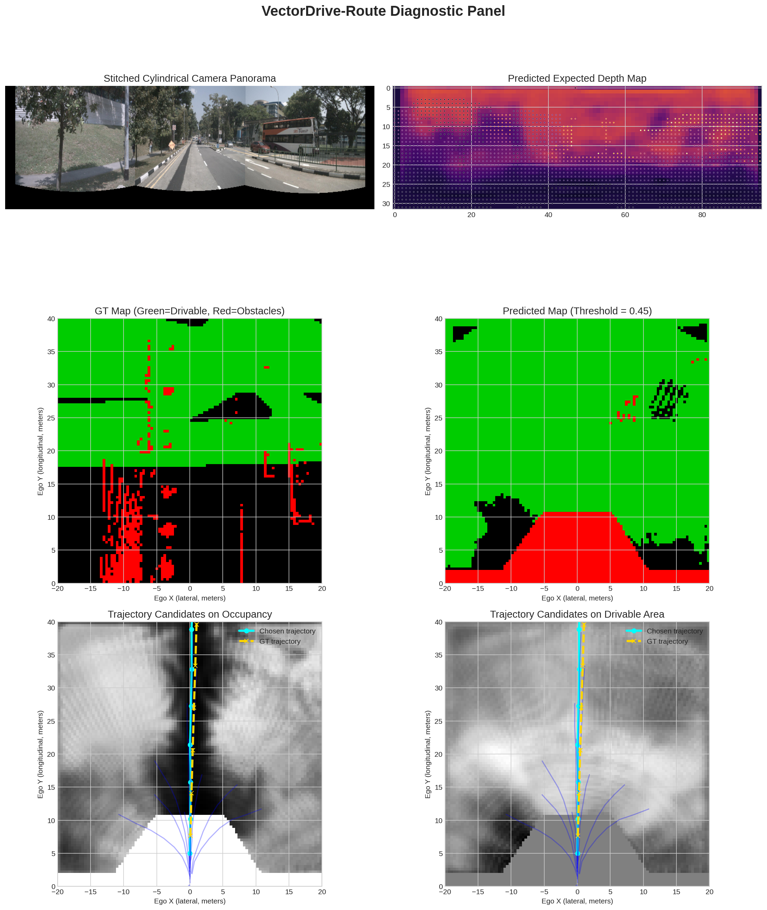
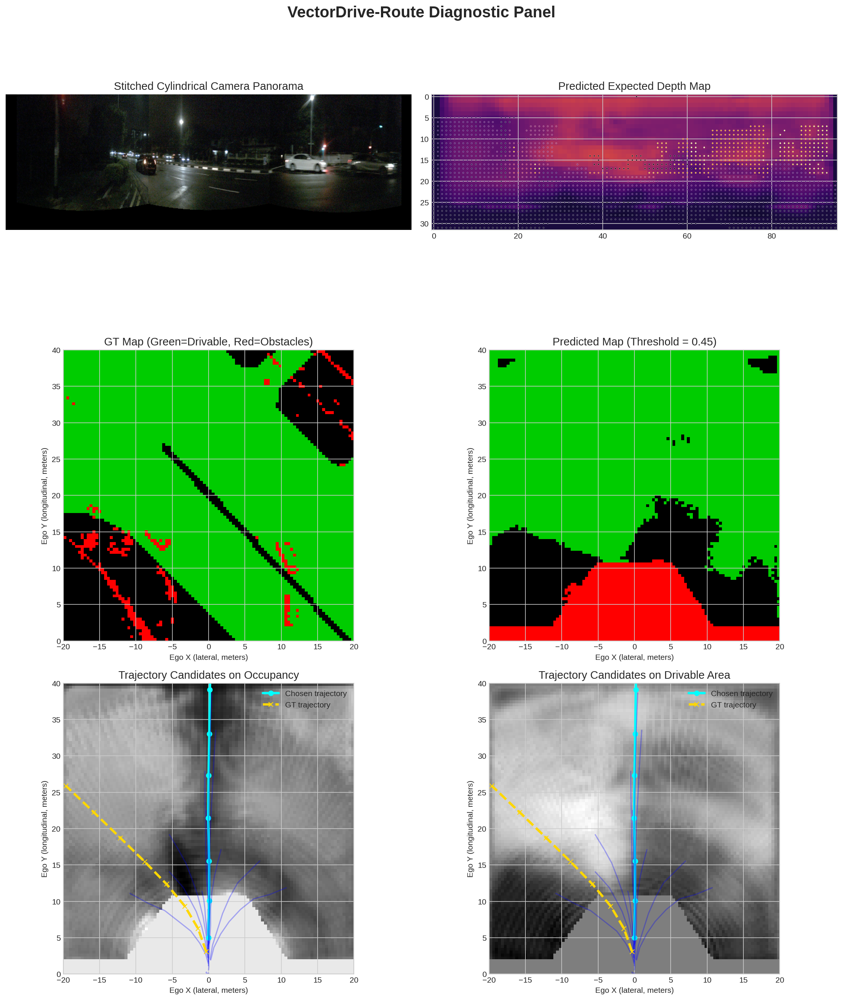
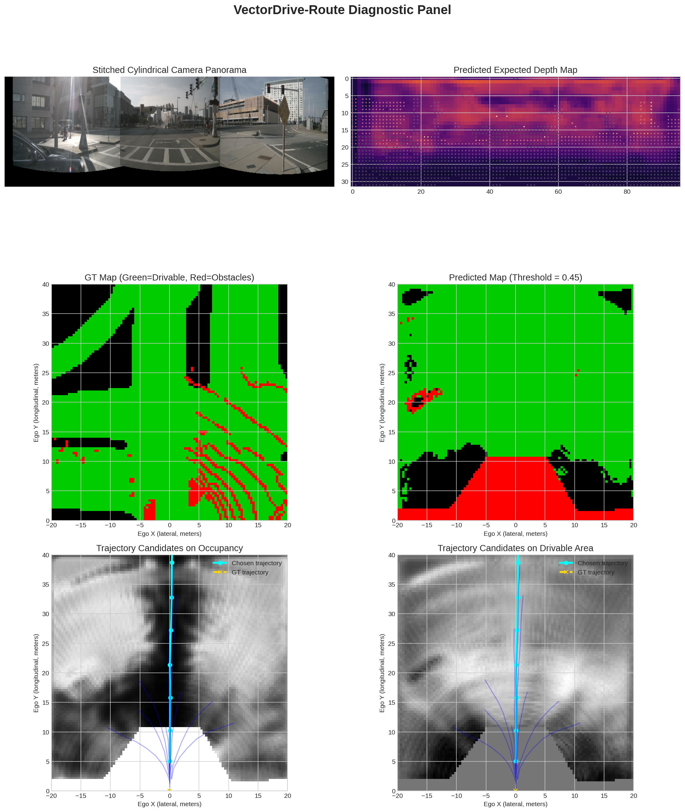

# VectorDrive-Route Evaluation Results

This report compiles the quantitative benchmark metrics and scenario diagnostic panels generated during the evaluation loop over the validation split.

---

## 📊 Trajectory Planner Benchmark

| Metric Category | Specific Evaluation Metric | Your Model's Score | Constant Velocity Baseline | Ego-State MLP Baseline |
| :--- | :--- | :---: | :---: | :---: |
| **Imitation Performance** | minADE (Trajectory L2 Error) (m) | **14.3837** | 0.5834 | 3.3647 |
| **Safety Compliance** | Drivable Area Compliance Rate (%) | **90.00%** | 94.62% | 96.15% |
| | Collision Rate (%) | **10.00%** | 5.38% | 3.85% |
| **Comfort & Kinematics** | Mean Trajectory Jerk ($m/s^3$) | **4.8882** | 0.0343 | 10.6477 |

---

## 📊 Perturbation Robustness Performance

| Perturbation Suite | minADE (Trajectory L2 Error) (m) | Collision Rate (%) |
| :--- | :---: | :---: |
| **Clean Baseline** | **14.3837** | **10.00%** |
| **Image Noise (Gaussian $\sigma=0.1$)** | **14.3981** | **10.00%** |
| **Calibration Drift (Yaw Shift $\pm 0.05$ rad)** | **14.3831** | **10.00%** |

---

## 🖼️ Exported Scenario Diagnostics

### Default Diagnostic Panel

### Scenario 1: Straight Cruising

### Scenario 2: Active Turn

### Scenario 3: Complete Stop

